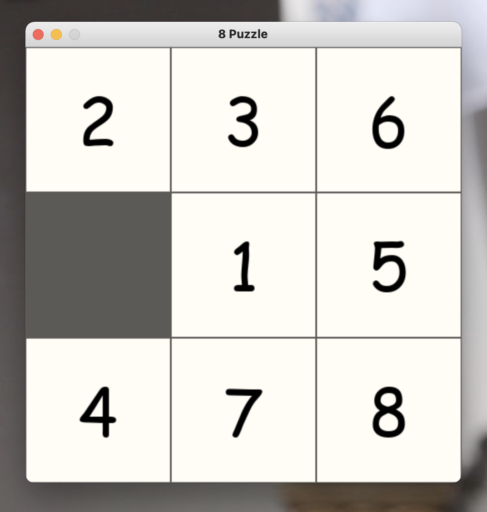

# README

# **Sliding Puzzle Problem**

The sliding puzzle problem is a classic problem in artificial intelligence in which you are given a board of size **`n x n`** containing a set of tiles, each with a unique number. Some of the tiles are blank, and the goal is to rearrange the tiles to a specific configuration using a series of moves in which you slide a tile into the blank space.

This code implements three different puzzle solvers

- Breadth First Algorithm : BFS is an algorithm for traversing or searching a graph, tree, or other data structure. It starts at the tree root (or some arbitrary node of a graph) and explores the neighbor nodes first, before moving to the next level neighbors.
- A* Algorithm : A* search is a heuristic search algorithm that combines the strengths of breadth-first search and uniform-cost search. It explores paths in the search tree by expanding the node that is estimated to be closest to the goal, using an evaluation function that estimates the cost of reaching the goal from a given node.
    - Heuristic 1: counting the number of misplaces tiles
    - Heuristic 2: finding the sum of the Manhattan distances between each block and its position in the goal configuration
- IDA* : Iterative deepening A* is a variant of the A* search algorithm that uses an iterative deepening approach to find the shortest path to the goal. It works by repeatedly increasing the depth limit of the search and using A* to search for a path within that limit, until a path is found or the entire search space has been explored.

## User Manual

To run the code, you will need to have Python 3 installed on your machine. You can then run the code using the following command:

```python
python play.py
```

A game will pop up on your desk 


Wanna use the puzzle in the puzzle file ? Type **Y** on the terminal

```python
Play with your puzzle in file Y/N:Y
```

You will have to choose the method you wanna test with the following commands (on the game screen)

```python
Go to the game and choose the type of search you want
i for IDA star search avec heuristic 1
j for IDA star search avec heuristic 2
a for A star search avec heuristic 1
z for A star search avec heuristic 2
b for Breadth-first search
s for shuffle
h for next move
```

Let’s test with A star search with heuristic 2 : Type on **z** key (of the keyboard) on the game screen

When the problem is solved, this information is displayed on the terminal

```python
The max value of frontier :  10
Took 0.010889292 seconds to find a solution of 9 moves
```

Wanna see the shortest path? The solution of the puzzle with A* and h2? 

Successively type on **h** key to get the next move until you reach the goal state

Initial state 

{width=400px height=200px}

**h**=1


**h**=2


**h**=3


And finally reach the goal state 


If you wanna test all of them you should run the [test.py](https://github.com/Biggs80085/N_Puzzle_AI/blob/main/test.py) file 

```python
python3 test.py
```

It will return the comparaison of different search algorithms, breadth-first search (BFS), A* search with two different heuristics, and IDA* search with two different heuristics. 

It uses a time limit and show the maximum n that each algorithm can solve.


## **Project Structure**

The project consists of the following files:

- N_Puzzle_AI
    - [play.py](https://github.com/Biggs80085/N_Puzzle_AI/blob/main/play.py) : Implementation the pygame
    - [model.py](https://github.com/Biggs80085/N_Puzzle_AI/blob/main/model.py) : Puzzle class
    - [ai.py](https://github.com/Biggs80085/N_Puzzle_AI/blob/main/ai.py) : AI search algorithms
    - [test.py](https://github.com/Biggs80085/N_Puzzle_AI/blob/main/test.py)

(More details on the report)
